<div align="center">


<h1>Platform Compliance Guardrails</h1>

<p><strong>The Enterprise Governance Engine for Policy-as-Code Enforcement, Automated Remediation, and Multi-Cloud Compliance.</strong></p>

[]()
[]()
[]()

<br/>

> **"Move fast, safely."** 
> **Platform Compliance Guardrails** is a mission-critical governance system designed to ensure every resource in your cloud estate adheres to organizational security standards. By abstracting complex regulatory frameworks (NIST, CIS, HIPAA) into Policy-as-Code, it provides preventive controls in CI/CD and detective self-healing in runtime.

</div>

---

## 🏛️ Executive Summary

Cloud scale makes manual compliance audits impossible. By the time an auditor finds a violation, the risk has often been present for months, creating significant regulatory exposure. Organizations often fail to secure their platforms because they lack a "Continuous Guardrail" system that acts as an automated, always-on auditor.

This platform provides the **Governance Control Plane**. It implements a complete **Compliance-as-Code Framework**, enabling Security and Compliance teams to manage institutional guardrails as a first-class citizen. By automating the remediation of security drift and orchestrating real-time CI/CD gates, we ensure that every organizational asset—from databases to clusters—is born compliant, audited for history, and automatically protected against misconfiguration.

---

## 📐 Architecture Storytelling: Principal Reference Models

### 1. Principal Architecture: Global Compliance Guardrails & Governance Plane
This diagram illustrates the end-to-end flow from framework mapping and policy definition to CI/CD gating, runtime scanning, automated remediation, and institutional auditing.

```mermaid
graph LR
    %% Subgraph Definitions
    subgraph FrameworkDesign["Compliance Framework Hub"]
        direction TB
        NistMap["NIST 800-53 Mapping"]
        CisMap["CIS Benchmark Catalog"]
        HipaaMap["HIPAA Compliance Pack"]
    end

    subgraph IntelligenceEngine["Governance Intelligence Hub"]
        direction TB
        API["FastAPI Compliance Gateway"]
        Evaluator["Policy-as-Code Evaluator"]
        ImpactSim["Guardrail Impact Simulator"]
        Registry["Policy & Exception Registry"]
    end

    subgraph EnforcementPlane["Enforcement & Remediation Hub"]
        direction TB
        Gate["CI/CD Compliance Gate"]
        Scanner["Real-time Drift Scanner"]
        Healer["Automated Remediation Engine"]
    end

    subgraph OperationsHub["Institutional Compliance Hub"]
        direction TB
        Scorecard["Global Compliance Scorecard"]
        Evidence["Automated Evidence Vault"]
        Audit["Forensic Compliance Lake"]
    end

    subgraph DevOps["Compliance-as-Code Orchestration"]
        direction TB
        TF["Terraform Guardrail Modules"]
        OPA["Admission Control Policies"]
        Remedy["Self-Healing Serverless Workers"]
    end

    %% Flow Arrows
    FrameworkDesign -->|1. Define Policy| API
    API -->|2. Translate Logic| Evaluator
    Evaluator -->|3. Simulate Impact| ImpactSim
    ImpactSim -->|4. Register Rule| Registry
    
    Registry -->|5. Enforce CI/CD| Gate
    Registry -->|6. Scan Runtime| Scanner
    Scanner -->|7. Trigger Healing| Healer
    
    API -->|8. Visualize Health| Scorecard
    Scorecard -->|9. Gather Proof| Evidence
    Scorecard -->|10. Record History| Audit
    
    TF -->|11. Provision Hub| IntelligenceEngine
    Healer -->|12. Execute Fix| Remedy
    Audit -->|13. Attest Compliance| FrameworkDesign

    %% Styling
    classDef design fill:#f5f5f5,stroke:#616161,stroke-width:2px;
    classDef intel fill:#e0f2f1,stroke:#004d40,stroke-width:2px;
    classDef enforcement fill:#e1f5fe,stroke:#01579b,stroke-width:2px;
    classDef ops fill:#f3e5f5,stroke:#4a148c,stroke-width:2px;
    classDef devops fill:#fffde7,stroke:#f57f17,stroke-width:2px;

    class FrameworkDesign design;
    class IntelligenceEngine intel;
    class EnforcementPlane enforcement;
    class OperationsHub ops;
    class DevOps devops;
```

### 2. The Compliance Lifecycle Management Flow
The continuous path of a regulatory requirement from initial framework assessment and definition to technical implementation, enforcement, and forensic auditing.

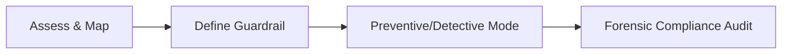

### 3. Preventive vs. Detective Guardrail Flow
Strategic orchestration of "Shift-Left" controls (blocking bad code in CI/CD) and "Runtime-Right" controls (detecting and remediating drift in live environments).

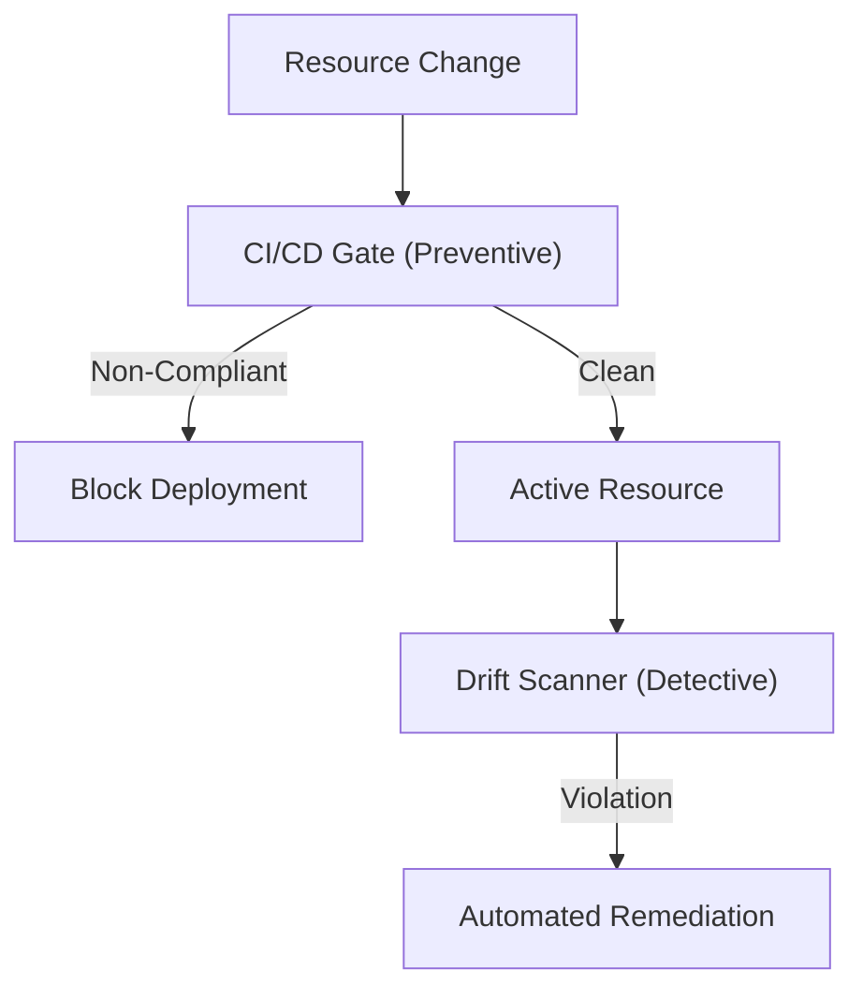

### 4. Multi-Framework Compliance Mapping Hub
Bridging technical policy rules to global regulatory standards like NIST 800-53, CIS Benchmarks, HIPAA, and SOC2 to ensure unified institutional attestation.

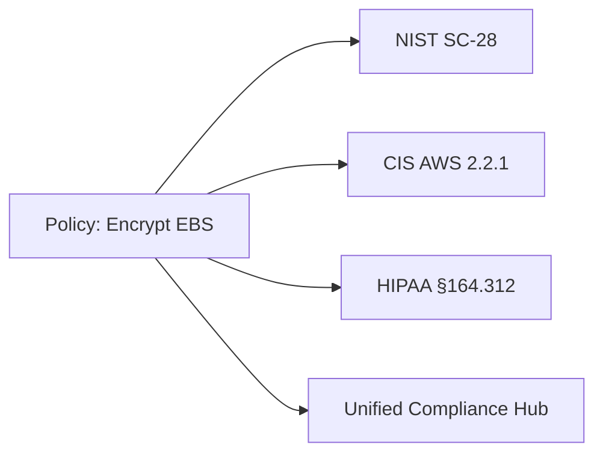

### 5. Automated Remediation (Self-Healing) Flow
Event-driven detection of high-risk security violations (e.g., Public S3 Buckets) and automated execution of neutralization logic without human intervention.

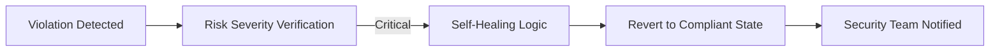

### 6. CI/CD Compliance Gate Orchestration
Implementing automated governance checkpoints within the software delivery pipeline to ensure that no non-compliant infrastructure can reach production.

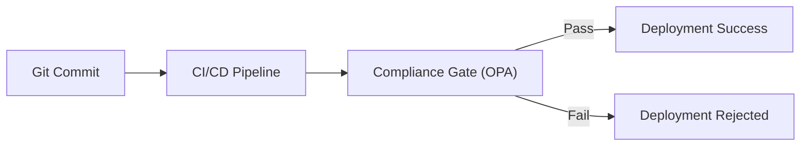

### 7. Institutional Compliance Scorecard
Grading organizational performance based on key indicators: Framework Adherence, Remediation Velocity, and Policy Exception Density.

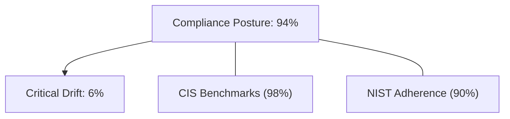

### 8. Identity & RBAC for Compliance Ops
Managing fine-grained access to guardrail definitions, remediation triggers, and audit evidence between security engineers and compliance auditors.

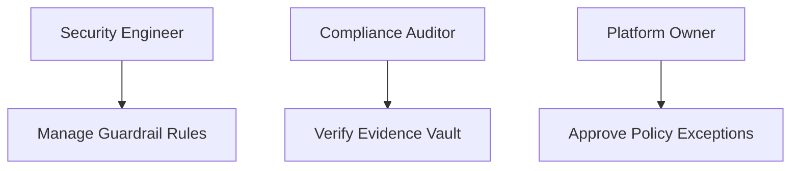

### 9. Policy Impact Assessment (PIA) Flow
Evaluating the potential organizational impact of a new guardrail by simulating its enforcement against historical resource data (Dry-Run Analysis).

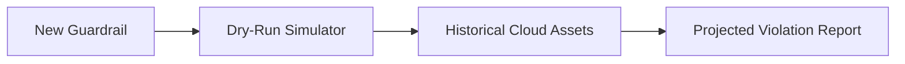

### 10. IaC Deployment: Compliance-as-Code Framework
Using Terraform to deploy and manage the versioned distribution of the compliance engine, scanning workers, and remediation serverless fabric.

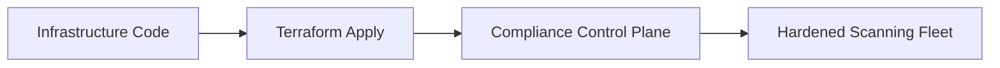

### 11. Metadata Lake for Forensic Compliance Audit
Storing long-term records of every violation, remediation action, and policy decision for institutional investigation and regulatory audit.

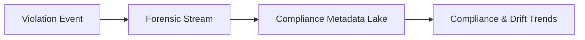

---

## 🏛️ Core Compliance Pillars

1.  **Policy-as-Code (PaC)**: Version-controlled, testable security rules that operate across all cloud providers.
2.  **Continuous Self-Healing**: Event-driven remediation of critical security violations in seconds, not days.
3.  **Preventive Guardrails**: Shifting security left by blocking non-compliant code at the pull request phase.
4.  **Multi-Framework Attestation**: Unified mapping to NIST, CIS, HIPAA, and ISO for institutional audit readiness.
5.  **Exception Lifecycle Management**: Formal, time-bound approval workflows for authorized policy deviations.
6.  **Full Auditability**: Immutable recording of every scan result and remediation action for institutional record-keeping.

---

## 🛠️ Technical Stack & Implementation

### Compliance Engine & APIs
*   **Framework**: Python 3.11+ / FastAPI.
*   **Evaluation Core**: Multi-mode engine for evaluating infrastructure against versioned policy libraries.
*   **Remediation Runner**: Serverless fabric for executing automated fixes across AWS, Azure, and GCP.
*   **Framework Mapper**: Logic for mapping technical rules to regulatory controls (NIST/CIS).
*   **State Management**: PostgreSQL (Metadata Lake) and Redis (Scan Cache).

### Compliance Dashboard (UI)
*   **Framework**: React 18 / Vite.
*   **Theme**: Dark, Emerald, Slate (Professional GRC aesthetic).
*   **Visualization**: Recharts for compliance score trends, risk heatmaps, and remediation velocity.

### Infrastructure & DevOps
*   **Runtime**: AWS EKS or Azure Kubernetes Service (AKS).
*   **IaC**: Modular Terraform for deploying the governance hub and scanning fleet distributions.

---

## 🏗️ IaC Mapping (Module Structure)

| Module | Purpose | Real Services |
| :--- | :--- | :--- |
| **`infrastructure/gov_hub`** | Central management plane | EKS, PostgreSQL, Redis |
| **`infrastructure/scanners`** | Multi-cloud drift detectors | Lambda, AWS Config, CloudTrail |
| **`infrastructure/remedy`** | Self-healing serverless fabric | Lambda, Step Functions, KMS |
| **`infrastructure/auditing`** | Forensic compliance sinks | S3, Athena, Quicksight |

---

## 🚀 Deployment Guide

### Local Principal Environment
```bash
# Clone the compliance platform
git clone https://github.com/devopstrio/platform-compliance-guardrails.git
cd platform-compliance-guardrails

# Configure environment
cp .env.example .env

# Launch the Compliance stack
make up

# Run a mock compliance scan simulation
make scan-iac
```

Access the Compliance Dashboard at `http://localhost:3000`.

---

## 📜 License
Distributed under the MIT License. See `LICENSE` for more information.

---
<div align="center">
  <p>© 2026 Devopstrio. All rights reserved.</p>
</div>
