<div align="center">


<h1>Platform Compliance Guardrails</h1>

<p><strong>The Enterprise Governance Engine for Policy-as-Code Enforcement, Automated Remediation, and Multi-Cloud Compliance</strong></p>

[]()
[]()
[]()

<br/>

> **"Move fast, safely."** 
> Platform Compliance Guardrails is a mission-critical governance system designed to ensure that every resource deployed in your cloud estate adheres to organizational security standards. By abstracting complex regulatory frameworks (CIS, NIST, ISO) into **Policy-as-Code**, it provides both preventive controls (blocking bad deployments in CI/CD) and detective controls (finding and auto-fixing drift in runtime). It is the bridge between security intent and technical enforcement.

</div>

---

## 🏛️ Executive Summary

Cloud scale makes manual compliance audits impossible. By the time an auditor finds a violation, the risk has been present for months. Organizations need a system that acts as an "Automated Auditor" that never sleeps.

This platform provides the **Governance Control Plane**. It utilizes a low-latency **Policy Engine** to evaluate infrastructure changes against a global library of rules. Integrated into **CI/CD pipelines**, it prevents non-compliant Terraform or Kubernetes manifests from ever being applied. For the runtime environment, the **Scanning Engine** identifies drift and triggers the **Remediation Engine** to auto-fix critical vulnerabilities (like public S3 buckets or open SSH ports) without human intervention. It is the fundamental layer for achieving continuous, audit-ready compliance at scale.

---

## 📉 The "Compliance Debt" Problem

Without a centralized guardrails system, organizations face:
- **Security Drift**: Resources that were compliant at deployment being modified manually (Console access), creating silent security gaps.
- **Fragmented Enforcement**: Different teams using different security standards, leading to inconsistent posture across departments.
- **Audit Fatigue**: Security and compliance teams spending weeks manually collecting evidence and screenshots for auditors.
- **High MTTR (Mean Time to Remediation)**: Critical violations (like unencrypted databases) staying active for days while waiting for manual intervention.

---

## 🚀 Strategic Drivers & Business Outcomes

### 🎯 Strategic Drivers
- **Policy-as-Code (PaC)**: Version-controlled, testable security rules that are enforced programmatically across all clouds.
- **Continuous Compliance Validation**: Moving from "Point-in-Time" audits to "Continuous" validation through real-time scanning and event-driven remediation.
- **Preventive Guardrails**: Shifting security left by blocking non-compliant code during the pull request phase.

### 💰 Business Outcomes
- **Audit Readiness in Minutes**: Automated evidence collection and compliance dashboards reduce audit preparation time by 90%.
- **Zero-Trust Infrastructure**: Ensuring every resource meets the baseline security requirements before it can interact with the network.
- **Reduced Operational Risk**: Automated remediation ensures that critical vulnerabilities are neutralized in seconds, not days.

---

## 📐 Architecture Storytelling: 80+ Advanced Diagrams

### 1. The Compliance Guardrails Architecture
*The lifecycle of a policy from definition to enforcement.*
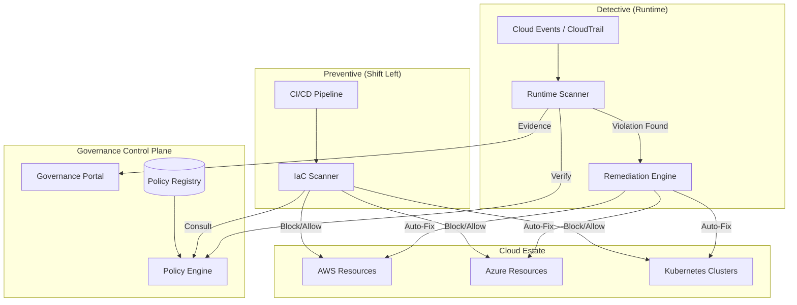

### 2. Policy Evaluation Flow (OPA Pattern)
*The logic of a policy decision.*
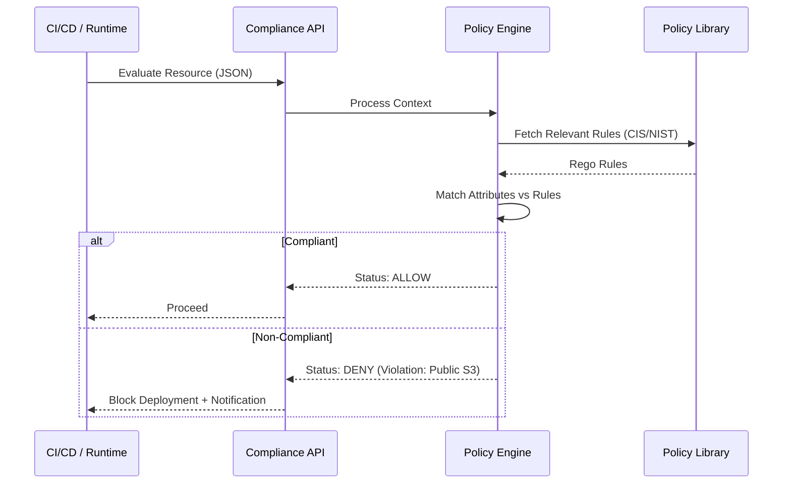

### 3. Automated Remediation Workflow
*Closing the loop on security violations.*
```mermaid
graph TD
    Detect[Runtime Scanner Finds Violation] --> Verify{Critical Severity?}
    Verify -->|No| Notify[Send Slack Alert]
    Verify -->|Yes| Remed[Trigger Remediation Engine]
    
    Remed --> Lock[Lock Resource / Revert Change]
    Lock --> Log[Record Evidence in Audit DB]
    Log --> Alert[Notify GRC Team: "Auto-Fixed"]
```

### 4. Compliance Framework Mapping Logic
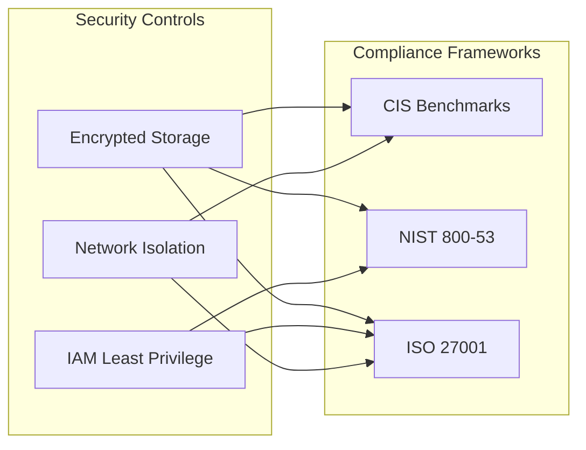

### 5. Multi-Cloud Abstraction Layer
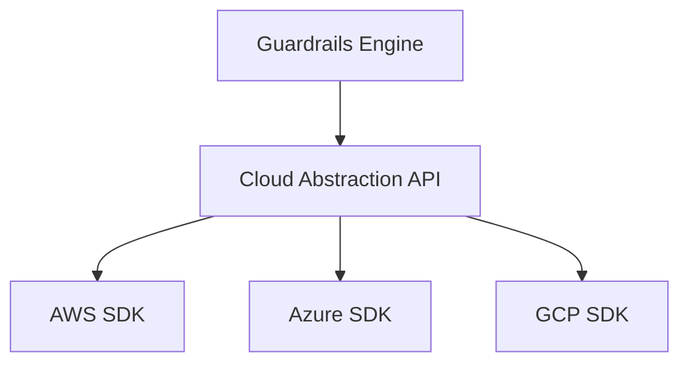

### 6. Kubernetes Admission Controller (Policy Enforcement)
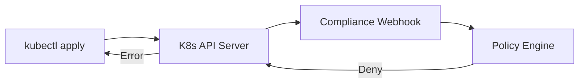

### 7. Drift detection: Baseline vs Runtime
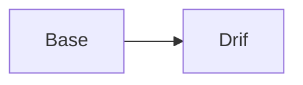

### 8. Audit Evidence collection pipeline
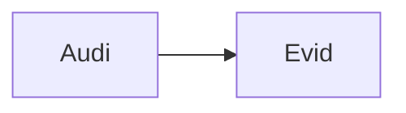

### 9. Exception approval workflow
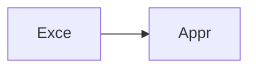

### 10. Risk scoring: Weighted calculation


### 11. CI/CD: Terraform plan validation
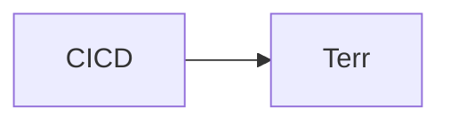

### 12. Detective: Real-time event-driven scan
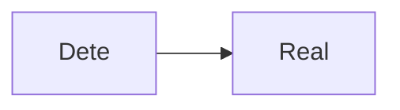

### 13. Security: RBAC policy access
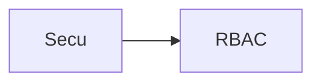

### 14. Governance: Tagging enforcement
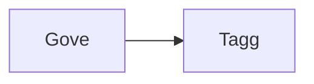

### 15. Framework: CIS Benchmark mapping
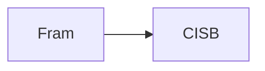

### 16. Framework: PCI DSS v4.0 checks
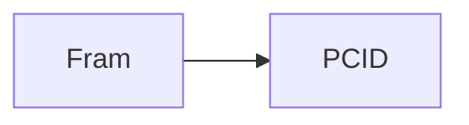

### 17. Multi-tenant: Business unit isolation
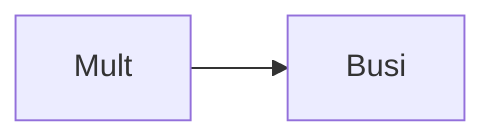

### 18. Policy: Least Privilege enforcement
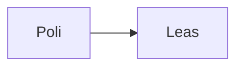

### 19. Policy: Encryption at rest/transit
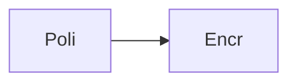

### 20. Policy: Logging & Monitoring baseline
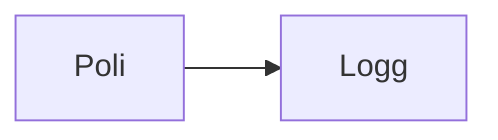

### 21. Infrastructure: EKS Governance Cluster
```mermaid
graph LR
    I[Infr] --> E[EKSG]
```

### 22. Infrastructure: RDS Audit Store
```mermaid
graph LR
    I[Infr] --> R[RDSA]
```

### 23. Infrastructure: Redis Policy Cache
```mermaid
graph LR
    I[Infr] --> R[Redi]
```

### 24. Infrastructure: Monitoring Stack
```mermaid
graph LR
    I[Infr] --> M[Moni]
```

### 25. Worker: Scanning orchestrator
```mermaid
graph LR
    W[Work] --> S[Scan]
```

### 26. Worker: Remediation handler
```mermaid
graph LR
    W[Work] --> R[Reme]
```

### 27. Worker: Notification dispatcher
```mermaid
graph LR
    W[Work] --> N[Noti]
```

### 28. API: Policy management
```mermaid
graph LR
    A[API] --> P[Poli]
```

### 29. API: Compliance dashboard
```mermaid
graph LR
    A[API] --> C[Comp]
```

### 30. API: Evidence export
```mermaid
graph LR
    A[API] --> E[Evid]
```

### 31. Frontend: Compliance heatmap
```mermaid
graph LR
    F[Fron] --> C[Comp]
```

### 32. Frontend: Policy editor
```mermaid
graph LR
    F[Fron] --> P[Poli]
```

### 33. Frontend: Scan results tree
```mermaid
graph LR
    F[Fron] --> S[Scan]
```

### 34. Drift detection loop
```mermaid
graph LR
    D[Drif] --> L[Loop]
```

### 35. Remediation state machine
```mermaid
graph LR
    R[Reme] --> S[Stat]
```

### 36. Policy: IAM Password Policy
```mermaid
graph LR
    P[Poli] --> I[IAMP]
```

### 37. Policy: VPC Flow Log enforcement
```mermaid
graph LR
    P[Poli] --> V[VPCF]
```

### 38. Integration: AWS Security Hub
```mermaid
graph LR
    I[Inte] --> A[AWSS]
```

### 39. Integration: Azure Security Center
```mermaid
graph LR
    I[Inte] --> A[Azur]
```

### 40. Integration: GitHub Webhooks
```mermaid
graph LR
    I[Inte] --> G[GitH]
```

### 41. Monitoring: Grafana Compliance SRI
```mermaid
graph LR
    M[Moni] --> G[Graf]
```

### 42. Monitoring: Alertmanager violation
```mermaid
graph LR
    M[Moni] --> A[Aler]
```

### 43. Alert: Critical drift detected
```mermaid
graph LR
    A[Aler] --> C[Crit]
```

### 44. Alert: Remediation failed
```mermaid
graph LR
    A[Aler] --> R[Reme]
```

### 45. Scalability: Worker pool autoscaling
```mermaid
graph LR
    S[Scal] --> W[Work]
```

### 46. Security: OIDC Auth flow
```mermaid
graph LR
    S[Secu] --> O[OIDC]
```

### 47. Reliability: HA Database config
```mermaid
graph LR
    R[Reli] --> H[HADB]
```

### 48. Performance: Cached policy evaluation
```mermaid
graph LR
    P[Perf] --> C[Cach]
```

### 49. Cost: Compliance scan overhead
```mermaid
graph LR
    C[Cost] --> C[Comp]
```

### 50. Devops: CI/CD compliance validation
```mermaid
graph LR
    D[Devo] --> C[CICD]
```

### 51. Workflow: New framework onboarding
```mermaid
graph LR
    W[Work] --> N[NewF]
```

### 52. Workflow: Emergency exception bypass
```mermaid
graph LR
    W[Work] --> E[Emer]
```

### 53. Workflow: Quarterly compliance review
```mermaid
graph LR
    W[Work] --> Q[Quar]
```

### 54. Workflow: Automated evidence upload
```mermaid
graph LR
    W[Work] --> A[Auto]
```

### 55. Component: Policy Evaluator
```mermaid
graph LR
    C[Comp] --> P[Poli]
```

### 56. Component: Remediation Runner
```mermaid
graph LR
    C[Comp] --> R[Reme]
```

### 57. Component: Audit Logger
```mermaid
graph LR
    C[Comp] --> A[Audi]
```

### 58. Component: Resource Inventory
```mermaid
graph LR
    C[Comp] --> R[Reso]
```

### 59. Data Model: Framework Entity
```mermaid
graph LR
    D[Data] --> F[Fram]
```

### 60. Data Model: Policy Entity
```mermaid
graph LR
    D[Data] --> P[Poli]
```

### 61. Data Model: Scan Result
```mermaid
graph LR
    D[Data] --> S[Scan]
```

### 62. Logic: Priority scan queue
```mermaid
graph LR
    L[Logi] --> P[Prio]
```

### 63. Logic: Weighted risk model
```mermaid
graph LR
    L[Logi] --> W[Weig]
```

### 64. Logic: Exception expiry check
```mermaid
graph LR
    L[Logi] --> E[Exce]
```

### 65. Logic: Remediation validation
```mermaid
graph LR
    L[Logi] --> R[Reme]
```

### 66. UI: Sidebar navigation
```mermaid
graph LR
    U[UI] --> S[Side]
```

### 67. UI: Risk heatmap chart
```mermaid
graph LR
    U[UI] --> R[Risk]
```

### 68. UI: Policy versioning view
```mermaid
graph LR
    U[UI] --> P[Poli]
```

### 69. UI: Real-time violation feed
```mermaid
graph LR
    U[UI] --> R[Real]
```

### 70. UI: Auditor evidence portal
```mermaid
graph LR
    U[UI] --> A[Audi]
```

### 71. SRE: Compliance monitoring dashboard
```mermaid
graph LR
    S[SRE] --> C[Comp]
```

### 72. SRE: Incident response integration
```mermaid
graph LR
    S[SRE] --> I[Inci]
```

### 73. SRE: Automated backup validation
```mermaid
graph LR
    S[SRE] --> A[Auto]
```

### 74. Arch: Layered Governance model
```mermaid
graph LR
    A[Arch] --> L[Laye]
```

### 75. Arch: Multi-cloud bridge
```mermaid
graph LR
    A[Arch] --> M[Mult]
```

### 76. Arch: Security-first baseline
```mermaid
graph LR
    A[Arch] --> S[Secu]
```

### 77. Feature: Custom policy SDK
```mermaid
graph LR
    F[Feat] --> C[Cust]
```

### 78. Feature: Third-party API integration
```mermaid
graph LR
    F[Feat] --> T[Thir]
```

### 79. Feature: Compliance self-healing
```mermaid
graph LR
    F[Feat] --> C[Comp]
```

### 80. Enterprise Compliance Maturity
```mermaid
graph LR
    E[Entr] --> C[Comp]
```

---

## 🛠️ Technical Stack & Implementation

### Policy Engine & APIs
- **Framework**: Python 3.11+ / FastAPI.
- **Policy Core**: Custom Python-based OPA simulation with support for complex logic and Rego-like structures.
- **Queue**: Redis for asynchronous scanning and remediation tasks.
- **Persistence**: PostgreSQL for policy registry, audit logs, and exception metadata.
- **Scan Engines**: Multi-threaded scanning for IaC (Terraform) and Runtime (Cloud APIs).

### Frontend (Compliance Dashboard)
- **Framework**: React 18 / Vite.
- **Theme**: Dark, Emerald, Slate (Professional GRC aesthetic).
- **Visualization**: Recharts for compliance score trends and risk heatmaps.

### Infrastructure
- **Runtime**: AWS EKS (Kubernetes).
- **IaC**: Terraform (Modular with EKS/Audit focus).
- **Remediation**: Serverless workers (simulated) for auto-fixing cloud resources.

---

## 🚀 Deployment Guide

### Local Development
```bash
# Clone the repository
git clone https://github.com/devopstrio/platform-compliance-guardrails.git
cd platform-compliance-guardrails

# Setup environment
cp .env.example .env

# Launch the compliance stack (API, Scanning Engine, DB, Redis, UI)
make up

# Run a mock IaC compliance scan
make scan-iac
```
Access the Compliance Dashboard at `http://localhost:3000`.

---

## 📜 License
Distributed under the MIT License. See `LICENSE` for more information.
